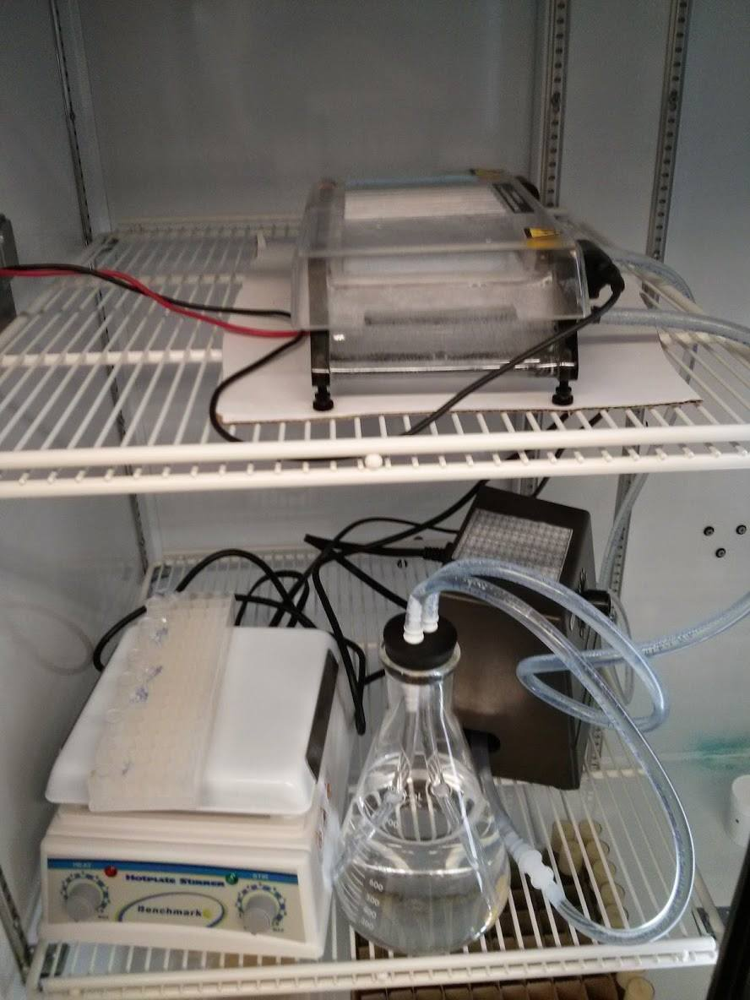

# Miscellaneous sharing

## Pulsed field gel electrophoresis

In doing long molecule sequencing, we've found that we have to evaluate the DNA length for QC purposes. Agilent Bioanalyzers and Tapestations don't handle truly long gDNA. So, we use pulsed field gel electrophoresis (PFGE). Specifically, we use the simplest field inversion gel electrophoresis (FIGE) variant.

So, here is the information for how we are running PGFE. [I have prepared a pdf](PFGE.pdf) which contains three pairs of pages. The first pair reviews plumbing, the next pair wiring, and the final pair, troubleshooting of wiring. 

First, a note on price. We got lucky, and the total price for the items on eBay were $200 for the Pulsewave 760 and $50 for the buffer recirculation pump. The prices do fluctuate quite a bit. I assume you already have access to a gel rig with buffer recirculation ports and a chromatography fridge. In case you don't have that kind of gel rig, you can get a new one for less than $500 (linked below). If you don't have the chromatography fridge, then you'll have to get a buffer chiller, an ice bucket, or run at room temperature.

### Caution & Disclaimer

The setup I describe works for us, but do your own sanity check and make sure it makes sense before doing this yourself. If in doubt, consult someone appropriate. I won't guarantee this will work for you even if it worked for us. I say this mainly because we can't find the "programming block" accessory for the Pulsewave, so we had to wire the blocks together manually. It goes without saying that connecting high voltage terminals together without being cautious is extremely dangerous. Do so at your own risk.

### Plumbing

Buffer recirculation is necessary to maintain contant pH and temperature during an extremely long run. I have added a 1 L flask with extra buffer to the loop just to make sure that extremely long runs can be accomplished without having to change the buffer mid-run. This may be optional or not depending on your buffer and run time. This isn't particularly necessary unless you have really long runs and are using TAE. Under such circumstances, TAE's buffering capacity can be exhausted, apparently. You'll need to get appropriate fittings to get all of the plumbing to work. Since we run the whole experiment in a chromatography fridge at 4C, we don't need a chiller. FYI, most protocols run at 13-15C. We're doing fine at 4C, though. You'll probably need to calibrate the pump. We run ours at 0.5-1.0 L / min (around 70-90 on our dial).

### Wiring

You plug the power supply into the back of the Pulsewave. When they are connected, the power supply should never be on when the Pulsewave is off. Read the disclaimer above again. To me, it seemed odd to connect Block A and Block B the way I have shown. However, we did it and it worked well enough to result in the gel [we've published](https://www.ncbi.nlm.nih.gov/pmc/articles/PMC5100563/figure/F1/). Also, read the [Pulsewave manual](Pulsewave760manual.pdf).

### Troubleshooting

I recommend getting a hold of a cheap low voltage power supply and digital multimeter just to convince yourself that the switching works the way you expect it to. For example, program the start time for 10 seconds and the end time for 10 seconds and set the ratio to 2. Set the run time to at least 0.1 hours (it will turn off after run time has elapsed, so if you're fiddling around for more than 6 minutes, increase the run time). If all is well, if you set your power supply to be 10V, then you should see the digital multimeter spend 10 seconds at 10V and 5 seconds at -10V and this pattern will be repeated as long as the run is active.

### The final setup
This is what the final setup looks like. While in use, the flask sits on the stirrer (unheated of course) and has a stir bar in it. The wires lead out of the chromatography refrigerator to the Pulsewave and the power supply and the multimeter. We put everything in the 4C to prevent overheating and because we don't have a chiller.

### Some useful links:

* [The pdf guide](PFGE.pdf)
* [Bioi-Rad Pulsewave 760 field inverter](https://www.ebay.com/sch/sis.html?_nkw=BIO+RAD+Pulsewave+760+1703603+Field+Switcher+C&_itemId=181566847281&_trksid=p2047675.m4099)
* [Bio-Rad Pulsewave 760 manual](Pulsewave760manual.pdf)
* [Bio-Rad Variable Speed Buffer Recirculation Pump](https://www.ebay.com/sch/i.html?_nkw=biorad+variable+speed+buffer+recirculation+pump)
* [Banana plug patch cables](https://www.amazon.com/Esco-Lite-High-Voltage-Cable-Banana/dp/B00ESXZ4XI/)
* [3-way stopcock](https://www.usplastic.com/catalog/item.aspx?itemid=23348&catid=438)
* [MP-1015 Multi-Purpose Electrophoresis System with buffer recirculation ports](https://www.ibisci.com/product-category/electrophoresis/horizontalelectrophoresis/horizontalelectrophoresis-mp1015)
* [Digital Multimeter](https://www.amazon.com/UNI-T-UT61D-True-Digital-Multimeter/dp/B00BRKYL7A/) (generally useful, but essential for troubleshooting)
* [Cheap, low voltage power supply](https://www.amazon.com/Tekpower-Variable-Supply-1-5-15-HY152A/dp/B000RO8J98) (useful for troubleshooting)
